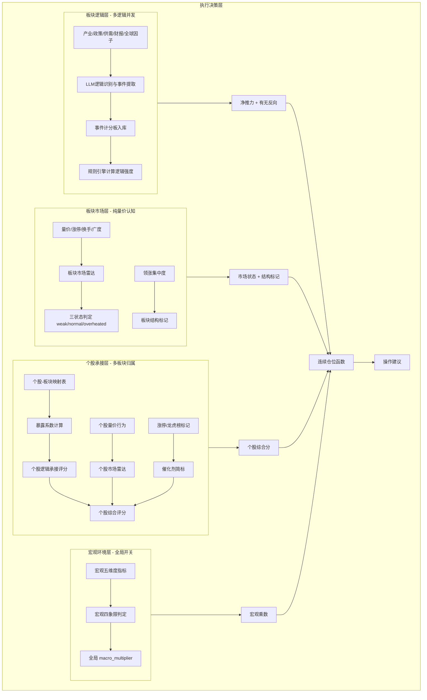

# 需求文档：交易逻辑驱动的智能选股系统（v7.1 MVP 工程化版）

> **Version**: 7.1-MVP  
> **Date**: 2026-04-18  
> **Status**: FINAL DESIGN  
> **更新说明**: 基于幻方量化工程实践 review，对 v7.0 进行 MVP 化裁剪与修正——砍掉不可行模块，简化过度设计，明确 LLM 输出契约与降级策略

---

## 文档说明

本版本基于 review_v3.md 的 11 条漏洞反馈进行系统性修正，核心变更原则：

1. **数据先行**：任何模块若依赖不可稳定获取的数据，Phase 0.5 不做
2. **简单有效**：用连续函数替代硬阈值矩阵，用三状态替代五状态机
3. **AI与规则协作**：需要专业经验的场景采用"LLM 定性判断 + 评分经验锚点"模式
4. **降级容错**：LLM 服务不可用时系统可降级运行
5. **避免过拟合**：减少自由参数数量，不做精细阈值拍板

### AI 协作原则：LLM 定性 + 评分经验锚点模式

对于需要专业判断、无法用纯规则编码的场景，采用以下协作模式：

```
步骤1：LLM 定性判断 —— LLM 阅读上下文信息，输出定性描述
步骤2：评分经验锚点 —— 提供结构化评分锚点（参考标准），让 LLM 对号入座
步骤3：规则引擎兜底 —— LLM 输出映射为数值后，由规则引擎最终校准
```

评分经验锚点示例（以逻辑重要性排序为例）：
```yaml
逻辑重要性评分锚点（供 LLM 参考，非强制打分）:
  极高重要性 (anchor=0.9):
    - 该逻辑能解释板块内 50% 以上龙头股近 20 日走势
    - 有明确的产业/政策/财务证据链支撑（≥3 条独立证据）
    - 市场共识度高（近 1 个月 ≥5 篇研报提及）

  高重要性 (anchor=0.7):
    - 能解释板块内 30%-50% 龙头股走势
    - 有 2 条独立证据支撑
    - 市场有一定共识（近 1 个月 ≥2 篇研报提及）

  中等重要性 (anchor=0.5):
    - 能解释板块内 10%-30% 龙头股走势
    - 有 1 条独立证据支撑
    - 市场共识模糊

  低重要性 (anchor=0.3):
    - 仅影响个别个股，板块层面影响微弱
    - 证据单一或存疑
    - 市场几乎无共识
```

LLM 使用锚点的方式：LLM 不需要精确计算上述指标，而是将锚点作为**经验参考**，判断当前逻辑落在哪个锚点区间，输出对应的 `importance_level`（高/中/低）。规则引擎将其映射为具体的强度参考值。

---

## 1. 系统定位与核心原则

### 1.1 系统本质

一个**多逻辑并发、多板块归属、真值与认知分离**的波段选股决策系统。系统通过以下步骤工作：

1. **识别逻辑**：对每个板块，识别当前所有活跃的交易逻辑（正向推动、反向压制）。
2. **评估逻辑真值**：基于可验证的产业/政策/供需/财务证据，通过**事件计分板**规则引擎计算逻辑强度（不依赖价格）。
3. **评估市场认知**：基于量价行为，评估板块热度与市场情绪（纯量价，不读逻辑证据）。
4. **个股承接映射**：结合个股的多板块归属，计算其对各项逻辑的受益/受损程度，确定个股综合评分。
5. **执行决策**：融合逻辑真值、市场热度、宏观环境，通过**连续仓位函数**输出操作建议。

### 1.2 核心原则（修正版）

| 原则 | 说明 |
|------|------|
| **逻辑真值独立于价格** | 一条逻辑是否成立、强度如何，由事件计分板规则引擎计算，不由股价涨跌证明。 |
| **市场认知描述交易状态** | 市场雷达图仅反映价格、量能、情绪扩散，用于判断交易热度和过热风险。 |
| **多逻辑并发，净推力决策** | 板块受多条逻辑共同作用，系统计算净推力 + 有无反向逻辑标记。 |
| **多板块归属，综合承接** | 个股可属于多个板块，其对不同逻辑的暴露需加权综合，形成个股逻辑评分。 |
| **LLM 作为逻辑识别与信息提取引擎** | LLM 基于领域知识识别板块的核心驱动逻辑、提取结构化事件记录，不打分。 |
| **简单有效优于精细理论** | Phase 0.5 采用连续函数替代离散矩阵，三状态替代五状态机，砍掉不可行数据模块。 |

### 1.3 交易边界

- **市场**：A股沪深主板、创业板、科创板
- **周期**：波段持仓3-20交易日
- **频率**：每日收盘后批量计算
- **股票池**：全市场近5日均成交额前300名 + 用户自选
- **排除**：ST、*ST、停牌、上市<60日、日均成交<1亿、当日跌停

---

## 2. 总体架构



**数据隔离铁律**：
- L1绝不读取L2/L3的任何价格相关数据。
- L2绝不读取L1/L3的逻辑证据，仅使用量价数据。
- L3读取L1输出（板块逻辑）和L2输出（板块市场），但自身逻辑承接计算仅使用基本面数据。
- L4消费所有层输出，不反向修改。

---

## 3. 宏观环境层 (L0) - 全局开关

### 3.1 宏观五维度评分

| 维度 | 关键指标 | 数据来源 | 评分规则 (0-10) |
|------|----------|----------|------------------|
| **流动性** | M1-M2剪刀差、Shibor期限利差、社融增速 | 央行/统计局 | 剪刀差收窄+1分，Shibor下行+1分，社融超预期+1分（基准5分） |
| **增长** | PMI新订单、工业增加值、消费增速 | 统计局 | PMI>50 +2分，PMI连续3月上升+1分 |
| **通胀成本** | PPI-CPI剪刀差、PMI购进价格 | 统计局 | 剪刀差收窄利好中下游+1分，过高通胀-1分 |
| **政策** | 政治局/国常会定调、产业政策密度 | 官方通稿 | 宽松/积极 +2分，紧缩/监管 -2分 |
| **全球** | Fed利率预期、10Y美债、地缘风险指数 | 公开数据 | 美债收益率下行+1分，风险事件-1分 |


### 3.2 宏观四象限（货币-信用框架）+ 评分经验锚点

| 象限 | 增长动能 | 流动性动能 | 判断规则 | macro_multiplier |
|------|----------|------------|----------|------------------|
| **宽信用期** | ↑ | ↑ | PMI>50且M1-M2剪刀差收窄 | 1.10 |
| **紧流动性期** | ↑ | ↓ | PMI>50但Shibor持续上行 | 0.95 |
| **双紧期** | ↓ | ↓ | PMI<50且流动性收紧 | 0.90 |
| **宽货币期** | ↓ | ↑ | PMI<50但央行降准/降息 | 1.05 |
| **中性** | - | - | 无明确方向 | 1.00 |

**评分经验锚点**（当数据处于临界值时，LLM 辅助定性判断）：
```yaml
PMI 临界锚点:
  明确扩张 (52+): 经济明确改善，权重 +1.0
  弱扩张 (50-52): 勉强扩张，经济改善信号弱，权重 +0.5
  收缩 (48-50): 经济走弱但未严重恶化，权重 -0.5
  明显收缩 (<48): 经济明显恶化，权重 -1.0

M1-M2 剪刀差临界锚点:
  明显收窄/转正: 企业活期存款增加，资金活跃，宽信用信号强
  微幅收窄: 边际改善，信号中等
  持续走阔: 资金定期化，实体经济活力下降，紧信用信号
```
当 PMI 处于 50±0.5 或 M1-M2 变化方向不明确时，LLM 根据近期经济数据走势和官方表态，定性判断应归入哪个锚点区间，辅助四象限判定。

**关键指标**：
| 维度 | 指标 | 来源 |
|------|------|------|
| 增长 | PMI新订单指数 | 统计局（月度） |
| 流动性 | M1-M2剪刀差、Shibor趋势 | 央行（月度/日度） |

**更新频率**：月度数据发布后次日更新。

### 3.3 宏观数据对齐与更新机制

**月度数据发布时点不同**：PMI 每月最后一天发布，M1/M2 次月 10-15 日发布。数据对齐规则如下：

| 时间窗口 | PMI | M1-M2 | 状态 |
|----------|-----|-------|------|
| 每月 1-10 日 | 上月值 | 上月值 | 完整数据 |
| 每月 11 日 - M1/M2 发布前 | 当月值 | 上月值 | `M1-M2_PENDING` |
| M1/M2 发布后 | 当月值 | 当月值 | 完整数据 |

**事件触发更新**：若月度数据之间发生重大事件，**立即**计算临时调整值并叠加到基准乘数上。

**重大事件清单与调整规则**（Phase 0.5 人工录入管理后台手动标记，系统不提供自动检测；Phase 2 可引入 LLM 阅读会议通稿进行定性判断）：

| 事件类型 | 判定标准 | macro_adjustment | 有效期 |
|----------|----------|-----------------|--------|
| 央行降准 | 央行公告下调存款准备金率 | +0.05 | 至下次月度数据更新 |
| 央行降息 | 央行公告下调 LPR/MLF/逆回购利率 | +0.05 | 至下次月度数据更新 |
| 央行升准 | 央行公告上调存款准备金率 | -0.05 | 至下次月度数据更新 |
| 央行加息 | 央行公告上调 LPR/MLF/逆回购利率 | -0.05 | 至下次月度数据更新 |
| 政治局会议定调"积极" | 会议通稿含"稳增长""宽松""积极财政""降准降息"等关键词 | +0.05 | 至下次月度数据更新 |
| 政治局会议定调"收紧" | 会议通稿含"防风险""去杠杆""稳健中性""收紧"等关键词 | -0.05 | 至下次月度数据更新 |

**计算方式**：
```
macro_multiplier = 基准乘数（基于月度四象限） + macro_adjustment
macro_multiplier = max(0.85, min(1.15, macro_multiplier))  # 上下限保护
```

**清零规则**：下次月度数据（PMI + M1-M2）完整发布后，`macro_adjustment` 自动清零，重新由四象限判定决定基准乘数。

**降级方案**：若连续两个月无法获取宏观数据，`macro_multiplier` 固定为 1.00，并标记 `MACRO_DATA_UNAVAILABLE`。

### 3.4 板块对宏观的敏感度矩阵

- **砍掉**：板块敏感度矩阵（31个一级行业 × 5维度 = 155个静态参数，维护成本过高且无法适应风格切换）
- **引入逻辑族映射**（产业趋势/政策驱动/流动性驱动/题材炒作 等 × 5维度 = 20个参数），逻辑族敏感度相对稳定

| 逻辑族 | 流动性敏感度 | 增长敏感度 | 通胀成本敏感度 | 政策敏感度 | 全球联动敏感度 |
|------|--------------|------------|----------------|------------|----------------|
| 产业趋势 | +0.9 | +0.7 | -0.2 | +0.6 | +0.4 |
| 政策驱动 | -0.3 | +0.2 | -0.1 | +0.8 | -0.2 |
| 流动性驱动 | +0.7 | +0.5 | +0.6 | +0.3 | +0.9 |
| 题材炒作 | -0.5 | -0.2 | -0.3 | +0.4 | -0.4 |

---

## 4. 板块逻辑层 (L1) - 事件计分板驱动

### 4.1 设计理念

一个板块在任何时刻都受到多条逻辑的共同作用。每条逻辑有**方向**（正向/反向）、**逻辑族**（产业趋势/政策驱动/事件驱动/流动性驱动）、**强度**（由事件计分板规则引擎自动计算，非LLM打分）。

**示例（黄金板块）**：
| 逻辑 | 方向 | 逻辑族 | 当前强度 | 事件来源 |
|------|------|--------|----------|----------|
| 全球央行降息预期升温 | positive | 流动性驱动 | 0.75 | Fed利率期货、欧央行表态 |
| 地缘冲突避险需求 | positive | 事件驱动 | 0.55 | 中东局势新闻、VIX指数 |
| 美元指数走强压制金价 | negative | 流动性驱动 | 0.45 | DXY走势、美债实际利率 |

### 4.2 LLM 输出契约（极简版）

LLM 只做两件事：**逻辑识别与归类**、**结构化事件提取**。不输出任何强度/评分。

#### 4.2.1 逻辑识别 Prompt（含评分经验锚点）

```
板块名称：{sector_name}
板块描述：{sector_description}
近期相关信息（无价格数据）：
- 宏观：{macro_events}
- 产业：{industry_events}
- 政策：{policy_events}

请分析当前影响该板块的主要交易逻辑，每条逻辑输出：
1. logic_id: 唯一标识（如 "gold_rate_cut_2026Q2"）
2. title: 一句话标题
3. description: 2-3句描述
4. direction: "positive" 或 "negative"
5. category: "产业趋势" / "政策驱动" / "事件驱动" / "流动性驱动" 四选一
6. evidence_summary: 列出不超过3条支持证据（引用自输入文本）
7. catalyst_events: 未来需跟踪的催化剂事件列表（不超过3条）
8. importance_level: "高" / "中" / "低"（参考下方评分锚点，不输出具体分数）

评分经验锚点（供参考，对号入座即可）:
- 高：该逻辑能解释板块内多数龙头股近20日走势，有≥3条独立证据，市场共识度高
- 中：能解释板块内部分龙头股走势，有1-2条独立证据，市场有一定共识
- 低：仅影响个别个股，证据单一或存疑，市场共识模糊

逻辑族分类锚点（供 category 判断参考）:
- 产业趋势：由行业供需变化、技术迭代、产品周期驱动的长期逻辑（持续数月）
- 政策驱动：由国家/部委政策直接引发的逻辑（有效期受政策生命周期限制）
- 事件驱动：由突发事件、地缘冲突、自然灾害等驱动的短期逻辑（持续数日至数周）
- 流动性驱动：由利率变化、资金面松紧、汇率波动驱动的逻辑

请按重要性排序，最多输出3条正向、2条反向。
输出严格JSON数组，字段名必须与上述一致。
```

**规则引擎映射**（LLM 输出 → 强度参考）：
```yaml
importance_level → initial_strength 参考值:
  高: 0.7
  中: 0.5
  低: 0.3
```
参考值仅作为初始强度的起点，后续由事件计分板规则引擎根据实际事件动态调整。

#### 4.2.2 事件提取 Prompt（两阶段提取）

**第一阶段：事件提取**（LLM 只提取事件，不关联 logic_id）：

```
基于以下新闻/公告/数据摘要，提取与板块 {sector_name} 相关的结构化事件：

输入信息：{news_items}

对每条相关信息，输出：
1. event_type: "国家级政策发布" / "龙头公司业绩超预期" / "产业数据改善" / "机构上调评级" / "政策收紧监管" / "龙头业绩暴雷" / "大股东减持" / "其他"
2. direction: "positive" 或 "negative"
3. summary: 一句话摘要（不超过50字）
4. event_date: 事件日期

输出严格JSON数组。
```

**第二阶段：logic_id 关联**（规则引擎自动完成，不调用 LLM）：
```
对每条未关联 logic_id 的事件：
1. 提取该事件的 summary 中所有实体名词（公司名、产品名、政策名等）
2. 遍历当前板块所有活跃逻辑的 evidence_summary 和 title
3. 计算 summary 与各逻辑 evidence_summary 的 Jaccard 相似度（基于分词后的词汇集合）
4. 若最高相似度 > 0.5，关联到该逻辑的 logic_id
5. 若最高相似度在 0.3~0.5 之间，标记为 "ambiguous"，记录日志并输出到人工审核队列，暂不计入计分板
6. 若最高相似度 < 0.3，标记为 "unmatched"，不计入计分板
```

**Phase 0.5 简化**：若事件 summary 中明确包含某逻辑的 title 关键词（精确匹配），则直接关联；否则留空为 "unmatched"。Jaccard 相似度计算与人工审核队列可在 Phase 0.5 后期引入。

#### 4.2.3 LLM 降级策略与事件解析容错

```yaml
LLM 降级策略:
  解析失败: 重试一次，仍失败则当日不更新事件表，logic_strength 沿用上一日（不衰减，因为无证据表明逻辑变弱），标记 "LLM_PARSE_ERROR"
  服务不可用: 逻辑层完全沿用上一日数据，强度按各逻辑自身的衰减速度执行（快逻辑每日 ≈0.01，慢逻辑每日 ≈0.002），系统降级为"市场层驱动"
  字段缺失: 必填字段缺失时，该条事件丢弃，其他有效事件正常处理
  event_type 不在预定义枚举: 用 LLM 进行二次归类（"请将'{event_type}'映射到以下枚举之一"），仍失败则丢弃

事件去重规则（含事件指纹）:
  编辑距离归一化预处理: 计算编辑距离前，先对 summary 做归一化：全角转半角、去除标点符号、转为小写
  编辑距离阈值: 归一化后字符串长度 ≥10 字符时阈值为 5；长度 <10 字符时阈值为 2
  事件指纹（event_hash）: 对每条事件计算 hash(logic_id + event_date + event_type + summary[:20])，入库前检查当日该 logic_id 下是否已存在相同 hash
  编辑距离去重: 若同一 logic_id 下，新事件的 summary 与当日已入库事件的 summary 编辑距离 < 阈值，视为重复，跳过入库
  同一 logic_id + 同一天 + 同一 event_type 的事件若重复提取，只计一次分（防止新闻转载导致重复加分）
```

### 4.3 事件计分板（规则引擎 + 评分经验锚点）

每条逻辑的强度由规则引擎根据结构化事件记录自动计算。事件类型的加减分值来自**行业专家评分**，而非 LLM 主观判断。

#### 4.3.1 计分规则（评分经验锚点）

事件加减分值设计参考以下专业经验锚点：

```yaml
事件计分板规则:
  初始强度: 0.5（新逻辑首次出现时，由 LLM 根据 importance_level 映射为 0.3/0.5/0.7）

  # 以下分值基于历史回测与行业专家经验设定
  正向事件加分:
    - 国家级政策发布: +0.20（有效期 20 日）
      # 锚点：国务院/发改委/工信部级别，直接针对该板块或含实质性支持条款
    - 龙头公司业绩超预期: +0.15（有效期 10 日）
      # 锚点：板块市值 Top 3 或成交 Top 3 龙头，净利润增速 > 一致预期 20%
    - 产业数据连续两月改善: +0.10（有效期 15 日）
      # 锚点：产量/库存/价格等核心指标连续 2 个月环比改善
    - 多家机构上调评级: +0.05（有效期 5 日）
      # 锚点：近 5 日 ≥2 家券商上调评级或目标价

  负向事件减分:
    - 政策收紧/监管问询: -0.25（有效期 15 日）
      # 锚点：监管层出台限制性政策或下发问询函
    - 龙头业绩暴雷: -0.30（有效期 20 日）
      # 锚点：龙头公司业绩大幅低于预期或出现重大亏损
    - 大股东减持: -0.10（有效期 10 日）
      # 锚点：控股股东/实控人/董监高公告减持计划
```

**LLM 辅助判断**：当事件类型模糊（event_type="其他"）时，LLM 根据事件摘要定性判断：
```
事件定性锚点（供 LLM 判断 "其他" 事件的方向和强度）:
  强正向 (score_impact=+0.15~+0.20): 直接改变板块供需格局或盈利预期的正面事件
  弱正向 (score_impact=+0.05~+0.10): 间接利好或情绪改善类事件
  强负向 (score_impact=-0.20~-0.30): 直接损害板块盈利能力或政策环境的事件
  弱负向 (score_impact=-0.05~-0.10): 间接利空或情绪冲击类事件
```

  正向事件加分:
    - 国家级政策发布: +0.20（有效期 20 日）
    - 龙头公司业绩超预期: +0.15（有效期 10 日）
    - 产业数据连续两月改善: +0.10（有效期 15 日）
    - 多家机构上调评级: +0.05（有效期 5 日）

  负向事件减分:
    - 政策收紧/监管问询: -0.25（有效期 15 日）
    - 龙头业绩暴雷: -0.30（有效期 20 日）
    - 大股东减持: -0.10（有效期 10 日）

  自然衰减:
    采用滑动窗口计数（非固定周期）:
      计时起点: 从逻辑的 last_event_date（最后一次事件入库日期）开始计算
      计数方式: 从 last_event_date 起，每经过 N 个交易日（期间无新事件入库），执行一次衰减
      衰减后重置: 执行衰减后更新 last_event_date 为当前交易日
      示例: 快逻辑 last_event_date=2026-04-01，至 2026-04-08 共 5 个交易日无新事件 → 04-08 收盘后衰减 0.05，last_event_date 更新为 2026-04-08
      避免刚加分就衰减: 若有新事件入库，last_event_date 自动更新，衰减计时重新开始
    事件驱动/政策驱动（快逻辑）: 每 5 个交易日衰减 0.05（每日 ≈0.01）
    产业趋势/流动性驱动（慢逻辑）: 每 10 个交易日衰减 0.02（每日 ≈0.002）

  锚点配置管理:
    存储方式: 所有评分锚点存放于 `anchors/` 目录下的独立 YAML 文件，系统启动时加载
    版本控制: 锚点配置文件纳入 Git 版本管理，每次修改记录变更原因和预期效果
    动态注入: LLM Prompt 中通过占位符 {anchor_content} 动态注入当前生效的锚点文本
    灰度能力: 配置文件包含 version 字段，支持对不同板块或用户组使用不同版本锚点进行 A/B 测试
    锚点文件清单:
      - anchors/logic_importance.yaml: 逻辑重要性评分锚点
      - anchors/logic_category.yaml: 逻辑族分类锚点
      - anchors/event_qualitative.yaml: 事件定性锚点
      - anchors/affiliation_strength.yaml: 归属强度判定锚点
      - anchors/industry_position.yaml: 产业链环节定位锚点

  强度范围: [0.15, 0.95]
  计算频率: 每日收盘后执行
```

#### 4.3.1b 事件有效期追踪（Phase 0.5 实现方案）

**Phase 0.5 采用每日全量重算**（事件量不大，每日 <100 条，实现简单不易出错）：

```
每日收盘后执行:
1. 遍历事件表中该逻辑的所有有效事件（event_date + 有效期天数 >= 当前交易日）
2. strength = 初始强度 + Σ(有效事件加减分) - Σ(自然衰减次数 × 衰减步长)
3. 截断到 [0.15, 0.95]
```

**事件表设计**（Phase 0.5 即需包含 expire_date 字段，为后续优化做准备）：
​```sql
CREATE TABLE events (
  id BIGINT PRIMARY KEY AUTO_INCREMENT,
  logic_id VARCHAR(64) NOT NULL,
  event_type VARCHAR(32) NOT NULL,
  direction VARCHAR(8) NOT NULL,
  score_impact DECIMAL(5,3) NOT NULL,
  event_date DATE NOT NULL,
  expire_date DATE NOT NULL,
  summary TEXT NOT NULL,
  event_hash VARCHAR(64) NOT NULL,
  created_at TIMESTAMP DEFAULT CURRENT_TIMESTAMP,
  INDEX idx_logic_expire (logic_id, expire_date),
  UNIQUE KEY uk_logic_date_type_hash (logic_id, event_date, event_type, event_hash)
);
```

**归档策略**（Phase 2）：每月将 `expire_date < NOW() - INTERVAL 30 DAY` 的事件迁移到 `events_archive` 表，主表只保留未过期事件，避免重算性能随时间线性增长。

#### 4.3.2 事件数据源与采集策略

事件数据采集采用**多源聚合、不限制单一数据源**的策略：

| 事件类型 | 数据源 | 采集方式 | 更新频率 |
|----------|--------|----------|----------|
| 国家级政策/部委文件 | 政府官网（国务院、发改委、工信部）+ 财经媒体 | 爬取 + RSS | 日度 |
| 龙头公司业绩公告 | Tushare 财报接口 + 巨潮资讯 | API + 爬取 | 季报/年报发布期 |
| 产业数据（产量、库存、价格） | Tushare 行业数据 + 第三方平台（生意社等） | API + 爬取 | 周度/月度 |
| 机构评级变动 | 东方财富研报摘要 + Tushare | API + 爬取 | 日度 |
| 监管问询/政策收紧 | 交易所公告 + 财经新闻 | 爬取 | 日度 |
| 大股东减持 | Tushare 股东增减持接口 | API | 日度 |
| 板块相关新闻摘要 | 雪球热帖 + 东方财富新闻 + Tushare 资讯 | 爬取 + API | 日度 |

**Phase 0.5 简化策略**：
- 新闻/资讯数据**优先使用 Tushare 资讯接口**（已接入、稳定）
- 雪球等第三方平台爬取作为**增量补充**（覆盖 Tushare 未收录的市场情绪类信息）
- 不强制要求所有数据源就绪——**至少有一个稳定新闻源即可启动**，后续逐步扩充

**事件采集流程**：
1. 每日收盘后，从各数据源采集当日与目标板块相关的新闻/公告/数据摘要
2. 拼接为统一文本输入到 LLM 事件提取 Prompt
3. LLM 输出结构化事件记录，存入事件表
4. 规则引擎扫描事件表，自动更新各逻辑强度

#### 4.3.3 衰减逻辑

### 4.4 板块净逻辑推力与反向逻辑标记

#### 4.4.1 简化版计算（Phase 0.5）

```
# 正向合力（角色权重简化为 constant，后续 Phase 可细化）
positive_force = Σ( positive_logic.strength )

# 反向合力
negative_force = Σ( negative_logic.strength )

# 净推力
net_thrust = positive_force - negative_force   # 理论范围可超 [-1, 1]
net_thrust = max(-1.0, min(1.0, net_thrust))   # 截断到 [-1, 1] 防溢出

# 有无反向逻辑标记（替代精细分歧系数）
has_headwind = negative_force > 0.4
# 若存在 strength > 0.4 的反向逻辑，标记为 True，执行时自动收紧风控
```

#### 4.4.2 执行层映射（简化版）

| 净推力 | 有无反向逻辑 | 执行含义 | 仓位建议 |
|--------|-------------|----------|----------|
| >0.3 | False | 一致看多 | 正常仓位 |
| >0.3 | True | 看多但有反向噪音 | 仓位降一档 |
| -0.1~0.3 | 任意 | 方向不明 | 观察/不参与 |
| <-0.1 | 任意 | 看空 | 不参与 |

**Phase 2 展望**：引入精细分歧系数 `divergence = 2 * min(pos, neg) / (pos + neg)`，通过回测确定最优阈值。

---

## 5. 板块市场层（L2）- 纯量价认知

### 5.1 板块市场雷达图计算规则

#### 5.1.1 技术面评分（0-10分）

| 子项 | 指标 | 计算公式 | 权重 | 评分映射规则 |
|------|------|----------|------|--------------|
| **趋势结构** | 均线排列与乖离 | `trend_score = 5 + 2.5 * ((C-MA20)/MA20/0.1 + (MA20-MA60)/MA60/0.1)` 截断0-10 | 30% | 价格>MA20且MA20>MA60得高分 |
| **量能配合** | 量比 | `vol_ratio = MA(VOL,5) / MA(VOL,20)` | 25% | `score = min(10, max(0, (vol_ratio-0.8)*10/0.7))` |
| **板块广度** | 站上20日线比例 | `breadth = count(close>MA20) / total_stocks` | 30% | `score = 10 * breadth` |
| **相对强度** | 相对全A强度 | `rel_str = sector_ret_10d / market_ret_10d` | 15% | `score = min(10, max(0, 5 + 5*(rel_str-1)/0.5))` |

**技术面综合分** = 加权求和。

#### 5.1.2 情绪面评分（0-10分）

| 子项 | 指标 | 计算方式 | 权重 | 评分规则 |
|------|------|----------|------|----------|
| **涨停热度** | 涨停扩散度 | `lu_ratio = 近5日涨停家数 / 成分股总数` | 40% | `score = min(10, lu_ratio * 50)` |
| **连板高度** | 龙头强度 | `max_board = 板块内最高连板天数（首板计1）` | 30% | `score = min(10, max_board * 2)` |
| **换手活跃度** | 交易热度 | `turn_ratio = MA(turnover,5) / MA(turnover,20)` | 30% | `score = min(10, max(0, (turn_ratio-0.8)*10/0.7))` |

**情绪面综合分** = 加权求和。

#### 5.1.3 资金面评分（Phase 0.5 可选）

若北向资金数据可用（通过稳定数据源获取），计算北向持仓变化作为资金面评分。若不可用，资金面不计入综合分。

#### 5.1.3b L2 情绪面数据源说明

情绪面评分依赖以下特殊数据，Phase 0.5 统一通过 **Tushare 接口** 获取（目前无现成模块，需新增接入）：

| 数据项 | Tushare 接口 | 用途 | Phase 0.5 状态 |
|--------|-------------|------|----------------|
| 涨停板列表 | `limit_list`（含连板数标记） | 涨停热度、连板高度、个股龙头识别 | 需新增接入 |
| 龙虎榜 | `top_inst`（机构净买入/净卖出） | 催化剂"中"标记判定 | 需新增接入 |
| 个股/板块日行情 | `daily` | 涨幅、成交额、均线、换手率等基础计算 | 已有 |
| 北向资金 | `hk_hold`（可选） | 资金面评分 | 需新增接入，Phase 0.5 可不做 |

#### 5.1.4 板块市场综合强度

```
if capital_score is not None:
    market_strength_raw = 0.45*technical + 0.35*sentiment + 0.20*capital
else:
    market_strength_raw = 0.55*technical + 0.45*sentiment

market_strength_score = sigmoid((market_strength_raw - 5) / 2)   # 0-1
```

### 5.2 三状态判定（替代五状态机）

| 状态 | 判定条件 | 执行含义 |
|------|----------|----------|
| **weak** | `market_strength_score < 0.4` | 市场热度不足，不参与 |
| **normal** | `0.4 ≤ market_strength_score ≤ 0.7` | 正常参与 |
| **overheated** | `market_strength_score > 0.7 且 情绪分_zscore > 1.5` | 谨慎/减仓，过热风险 |

**情绪分 z-score 归一化**（替代绝对阈值 8，消除板块间情绪基线差异）：
```
情绪分_zscore = (当前情绪分 - 板块近60日情绪分均值) / 板块近60日情绪分标准差
```

**分层回退策略**（防止新板块/新板块历史数据不足时回退失效）：
```
if 板块历史数据 >= 20 日:
    使用 z-score（20日均值和标准差替代60日）
elif 板块历史数据 >= 5 日:
    使用 (当前值 - 近5日均值) / 近5日标准差 作为简易归一化
else:
    回退到绝对阈值，按板块类型微调:
    if 板块类型 in ["券商", "次新股"]: 阈值 = 9
    elif 板块类型 in ["银行", "公用事业"]: 阈值 = 7
    else: 阈值 = 8
    标记 "INSUFFICIENT_HISTORY"
```

### 5.3 领涨集中度（替代显式分支分析）

#### 5.3.1 为什么砍掉分支映射表

全市场 400+ 概念板块，每个都人工划分分支不现实。聚类算法辅助在 Phase 0.5 也不现实。用**纯量价代理指标**达到相同效果。

#### 5.3.2 计算规则

| 指标 | 计算方式 | 含义 |
|------|----------|------|
| **领涨集中度** | `top20_pct_turnover / total_sector_turnover`（板块内涨幅前20%个股的成交额占比） | 占比 > 60% 说明资金高度聚焦少数个股（隐性分支领涨） |
| **轮动速度** | `连续两日领涨个股重叠率 = len(昨日top20% ∩ 今日top20%) / len(昨日top20%)` | 重叠率 < 30% 说明轮动快，持续性差 |

**前置过滤**（防止极端行情下集中度失真）：
```
if len(成分股) < 10:  # 板块太小，统计偏差大
    集中度 = None，结构标记 = "无法判断"
elif 板块近5日涨幅 < -3%:  # 明显下跌行情，集中度无意义
    集中度 = None，结构标记 = "弱势"
elif 板块近5日涨幅 < 0 且 avg(前20%个股涨幅) > 2%:  # 结构性逆势领涨
    正常计算集中度，结构标记附加 "_逆势"
elif avg(前20%个股涨幅) < 3%:  # 领涨个股涨幅不足
    集中度 = None，结构标记 = "弱势"
else:
    正常计算集中度
```

#### 5.3.3 结构标记输出

| 结构标记 | 特征 | 执行影响 |
|----------|------|----------|
| **聚焦** | 领涨集中度 > 60% | 优先配置领涨个股 |
| **扩散** | 领涨集中度 < 40% | 板块普涨，可配置中军 |
| **快速轮动** | 轮动速度重叠率 < 30% | 谨慎，仅轻仓试探 |

输出 `sector_structure_type` ∈ {聚焦, 扩散, 快速轮动}。

---

## 6. 个股承接层（L3）

### 6.1 多板块归属与暴露计算

#### 6.1.1 个股-板块映射表（Phase 0.5 数据策略）

每只股票维护一个归属映射表：

```json
{
  "stock_code": "300502",
  "affiliations": [
    {"sector_code": "通信设备", "type": "industry", "strength": 1.0},
    {"sector_code": "CPO", "type": "concept", "strength": 1.0},
    {"sector_code": "AI算力", "type": "concept", "strength": 0.8}
  ]
}
```

一只股票可能属于：
- **申万行业板块**（唯一或主要）
- **多个概念板块**
- **风格板块**（如"高股息"、"专精特新"）

**Phase 0.5 数据来源**：
- 申万行业分类：通过 Tushare 接口获取（`ts_code` → `sw_l1`/`sw_l2`）
- 概念板块映射：通过**东方财富**接口获取（东方财富概念板块覆盖最全，包括市场热点概念）
- 归属强度 `strength`：Phase 0.5 采用**简化赋值策略**——行业板块 = 1.0（唯一归属），概念板块 = 1.0（主营概念）/ 0.8（强关联）/ 0.5（弱关联）

**归属强度判定锚点**（LLM 用于判断概念板块关联程度）：
```yaml
归属强度判定锚点（供 LLM 判断个股与概念板块的关联度）:
  主营概念 (strength=1.0):
    - 板块名称与个股主营产品/服务直接对应
    - 市场共识：该个股被公认为该板块的核心标的

  强关联 (strength=0.8):
    - 板块名称与个股主营产品/服务部分对应
    - 个股有相关产品线但非主营，或业务处于转型期

  弱关联 (strength=0.5):
    - 板块名称与个股仅有概念性关联
    - 个股有相关业务但占比极小，或因热点概念被纳入
```
LLM 在首次识别个股板块归属时，使用上述锚点对号入座。后续可在 Web 界面由用户手动修正。

**Phase 2 细化方向**：
- 引入**营收占比数据**作为 `strength` 的量化依据（需业务级别拆解数据，目前数据源未就绪）
- 用机构一致预期/研报覆盖度校准概念强度

#### 6.1.2 龙头公司定义（事件计分板使用）

事件计分板中"龙头公司业绩超预期"和"龙头业绩暴雷"的"龙头公司"按以下优先级识别：

| 优先级 | 龙头定义 | 数据来源 | 说明 |
|--------|----------|----------|------|
| **1. 市值龙头** | 板块内总市值 Top 3 | Tushare 日线 + 股本数据 | 最稳定、最客观的定义 |
| **2. 成交龙头** | 板块内近20日日均成交额 Top 3 | Tushare 日线 | 反映市场关注度，适合高换手板块 |
| **3. 逻辑龙头** | 逻辑受益度最高的个股 | L3 暴露系数计算结果 | 与具体逻辑强绑定的核心受益标的 |

**使用规则**：
- "龙头公司业绩超预期/暴雷"事件优先匹配 **市值龙头**（最明确、数据最稳定）
- 若某条逻辑有明确的 **逻辑龙头**（如"AI算力需求爆发"对应特定芯片设计龙头），则该逻辑相关事件优先匹配逻辑龙头
- 龙头名单**月度更新**，避免频繁切换导致事件归属混乱

#### 6.1.3 暴露系数计算

对于个股归属的每个板块的每条活跃逻辑：

```
exposure = affiliation_strength × logic_match_score
```

**logic_match_score**（0-1）由以下因素综合判定：

| 因素 | 权重 | 评分方式 | Phase |
|------|------|----------|-------|
| 业务关键词匹配 | 60% | 静态关键词库 + 规则匹配（见下方关键词库设计） | Phase 0.5 |
| 产业链环节定位 | 40% | 个股在产业链中的位置是否直接受益（上游/中游/下游），由 LLM 在逻辑识别时一次性标注，后续缓存 | Phase 0.5 |

**产业链环节定位评分锚点**（LLM 判断个股对逻辑的受益程度）：
```yaml
产业链环节定位锚点（供 LLM 判断个股受益程度）:
  直接受益 (score=0.9):
    - 个股是板块核心逻辑的直接标的（如"CPO"逻辑下的光模块龙头）
    - 主营产品/服务与逻辑高度重合（营收占比 ≥30% 或市场公认核心标的）
    - 产业链位置处于逻辑传导的第一环（如 AI 算力需求 → GPU/光模块制造商）

  间接受益 (score=0.6):
    - 个股业务与逻辑相关但非核心（如"AI算力"逻辑下的散热材料供应商）
    - 主营产品/服务部分涉及（营收占比 10%-30%）
    - 产业链位置处于逻辑传导的第二环（如 AI 算力需求 → 散热/电源/连接器供应商）

  边缘受益 (score=0.3):
    - 个股与逻辑仅有概念关联（如"AI算力"逻辑下的普通 IT 外包公司）
    - 主营产品/服务少量涉及（营收占比 <10%）
    - 产业链位置处于逻辑传导的外围

  不受益 (score=0.1):
    - 个股与逻辑无实质关联，仅因板块归属被覆盖
    - 主营业务描述中不包含任何逻辑关键词
```

**缓存刷新触发条件**：
- 个股发布重大资产重组公告 → 清空该个股的产业链缓存，下次匹配时重新调用 LLM 标注
- 每季度财报发布后，统一刷新全部个股的产业链缓存（批量调用 LLM 更新）

**Phase 0.5 关键词库全自动生成策略**（替代人工维护，消除维护成本）：

```python
# 对新板块首次出现时，调用一次 LLM 生成关键词（一次性成本）：
prompt = f"请为'{sector_name}'板块生成5-8个核心业务关键词，用于匹配个股主营业务描述。关键词应为该板块上市公司的典型产品、技术或服务名称，用中文，每行一个。"
# 将结果缓存到关键词库，后续个股匹配直接用缓存，不再调用 LLM

# 示例缓存结果：
sector_keywords = {
  "CPO": ["光模块", "光引擎", "硅光", "800G", "1.6T", "CPO"],
  "AI算力": ["服务器", "GPU", "算力租赁", "数据中心", "AI芯片"],
  "新能源车": ["锂电池", "整车", "充电桩", "正极材料", "磷酸铁锂"],
  "半导体": ["晶圆代工", "封装测试", "EDA", "光刻机", "芯片设计"],
}

匹配规则:
  高匹配 (0.9): 个股主营业务描述包含 ≥2 个关键词
  中匹配 (0.6): 主营业务描述包含 1 个关键词
  低匹配 (0.3): 无关键词匹配，但属于该板块
```

**关键词库修正**：提供 Web 界面允许用户手动修正错误关键词（非必需操作，系统默认使用自动生成的关键词库）。

**Phase 2 细化方向**：
- 引入**机构研报提及**因子（需接入研报数据源，Phase 0.5 不做）
- 用 Embedding 语义相似度替代关键词匹配，提升泛化能力

若无足够数据，默认 `logic_match_score = 0.1`。

### 6.2 个股逻辑承接评分 (stock_logic_score)

```
raw_logic_score = Σ( exposure_i × logic_i.strength × logic_i.direction_sign )
```
其中 `direction_sign` = +1 (正向) / -1 (反向)。

`raw_logic_score` 通过 sigmoid 函数映射到 0-1：

```
stock_logic_score = 1 / (1 + exp(-k * raw_logic_score))
```
k取3~5，使得raw在[-0.5,0.5]区间内映射到0.2~0.8。

### 6.3 催化剂简化标记（Phase 0.5）

**砍掉**：业绩预告超预期（需付费一致预期数据）、重大合同/中标（需PDF NLP提取）、机构调研家数（数据分散难获取）。

**保留**的简化标记（均为收盘后可稳定获取的公开数据）：

| 催化剂标记 | 判定方式 | 执行层使用 |
|------------|----------|------------|
| **强** | 近3日有涨停 或 近5日涨幅>20%且量比>1.5 | 持有信心标记，不作为排序加分 |
| **中** | 龙虎榜机构净买入 或 北向资金连续3日净买入（如有数据） | 持有信心标记，不作为排序加分 |
| **无** | 以上都不满足 | - |

**设计原因**：催化剂的真正价值在执行层提供持有信心，而非用于排序。增加"近5日涨幅>20%且量比>1.5"作为"强"标记的替代条件，覆盖趋势股（沿5日线稳步上涨、从未涨停）的催化剂缺失问题。

> **注意**：催化剂标记为**滞后确认信号**。当"近5日涨幅>20%且量比>1.5"条件满足时，最佳买点可能已过。催化剂标记仅用于增强持仓信心，不作为买入触发条件。执行层的买入决策由市场雷达和逻辑推力共同决定。

### 6.4 个股市场雷达

完全类比板块市场雷达，但数据源为个股。

| 维度 | 子项 | 权重 | 计算 |
|------|------|------|------|
| 技术面 | 趋势结构（MA20/MA60） | 30% | 同板块 |
| 技术面 | 量能配合（量比） | 25% | 同板块 |
| 技术面 | 相对板块强度 | 25% | 个股近10日涨幅/所属主板块近10日涨幅 |
| 技术面 | 波动率特征（ATR） | 20% | ATR收缩/扩张状态 |
| 情绪面 | 涨停情况 | 50% | 近5日涨停次数、是否龙头 |
| 情绪面 | 换手活跃度 | 50% | 换手率5日/20日 |

`stock_market_score` = 0.5×技术面 + 0.5×情绪面，再sigmoid归一化。

### 6.5 个股综合评分与雷达图可视化

#### 6.5.1 综合评分公式

```
stock_composite_score = 0.50 * stock_logic_score + 0.50 * stock_market_score
```

#### 6.5.2 四维雷达图设计（砍掉估值安全度）

**删除"估值安全度"维度原因**：A股估值高度周期性，PE分位高≠危险（2020新能源），PE分位低≠安全（2022银行地产）。作为固定维度会给用户错误锚定。

保留四个有明确计算逻辑的维度：

| 维度 | 数值来源 | 含义 |
|------|----------|------|
| **逻辑受益度** | `stock_logic_score × 100` | 个股受益于当前市场逻辑的程度 |
| **市场强度** | `stock_market_score × 100` | 个股自身量价表现 |
| **催化剂标记** | 强→80, 中→50, 无→20 | 近期催化剂简单标记 |
| **板块强度** | 所属最强板块 `market_strength_score × 100` | 个股所处的板块环境 |

#### 6.5.3 个股地位识别（龙头/中军/跟风）

基于个股在其**主归属板块**内的表现自动判定：

| 地位 | 规则 |
|------|------|
| **龙头** | 近10日涨幅位于板块前10% 且 近5日有涨停 且 `logic_match_score` ≥ 0.7 |
| **中军** | 总市值板块前5 且 近20日日均成交额板块前5 |
| **跟风** | 其余 |

**蓄力中军规则**：Phase 0.5 采用**纯标签方案**（不修改综合分）。板块市场状态为 normal 或 overheated，中军个股 `stock_market_score` < 0.5 时，标记为"蓄力中军"，在推荐列表中展示"⚡蓄力"标签，供用户优先关注。

**Phase 2 量化方案**（待回测评估）：改为在 `stock_market_score` 的计算中，将"相对板块强度"的权重从 25% 临时降至 10%（因为中军本就该滞后于小盘龙头）。Phase 0.5 不实现此方案。

---

## 7. 执行决策层（L4）- 连续函数替代离散矩阵

### 7.1 连续仓位函数（Phase 0.5）

**砍掉**8行离散决策矩阵的原因：硬阈值断裂（0.30 vs 0.29 导致"重仓" vs "观察"的差异），参数过多，未经回测验证。

**替代方案**：

```yaml
# config/position_weights.yaml
# Phase 0.5 直接使用以下默认值运行，积累实盘/回测数据后再调整
position_weights:
  net_thrust: 0.4        # 待回测
  stock_composite: 0.4   # 待回测
  market_strength: 0.2   # 待回测
# 若某权重为 0，表示该维度不参与仓位计算（便于后续消融实验）
```

```python
# 基础仓位分（权重从 config/position_weights.yaml 读取）
position_score = (normalized_net_thrust * weights["net_thrust"]
                  + stock_composite_score * weights["stock_composite"]
                  + market_strength_score * weights["market_strength"]) * macro_multiplier
```

# 净推力归一化到 0-1：normalized_net_thrust = (net_thrust + 1) / 2

# 反向逻辑收紧
if has_headwind:
    position_score *= 0.85  # 仓位降一档

# 结构标记收紧
if sector_structure_type == "快速轮动":
    position_score *= 0.80

# 仓位映射（仅2个自由参数，回测易调）
if position_score > 0.75:
    position = "重仓"  # 建议 40-50% 单票上限
elif position_score > 0.50:
    position = "半仓"  # 建议 20-30%
elif position_score > 0.30:
    position = "轻仓"  # 建议 10-15%
else:
    position = "观察"  # 不参与
```

**止损与持有决策**：

| 触发条件 | 动作 |
|----------|------|
| 主逻辑 strength 较持仓期间最高值回撤 > 0.15 | 减仓 |
| 板块市场状态从 normal/overheated 降为 weak | 退出 |
| 板块结构变为"快速轮动" | 减仓或缩短止损周期 |
| 分歧系数 divergence 从 <0.3 飙升至 >0.7 且价格滞涨 | 减仓观察 |

**止损计算细节**（滚动高点回撤替代建仓日锚定）：
```
# 持仓期间每日记录 logic_strength 的最高值
peak_strength = max(持仓期间所有交易日的 logic_strength)
if peak_strength - current_strength > 0.15:
    触发减仓信号
```
此方式避免了"先升后降"场景下建仓日锚定的僵化——即使当前强度高于建仓日，但较高点已显著回撤，同样视为逻辑弱化。

### 7.2 A 股交易约束检查

在输出推荐前，对每只个股进行**交易可行性过滤**，确保推荐可执行。不同板块涨跌幅限制不同，约束条件需区分：

| 场景 | 处理方式 | 用户提示 |
|------|----------|----------|
| 主板/中小板当日涨停（+10%） | 不推荐买入 | "观察，等待分歧" |
| 科创板/创业板当日涨停（+20%） | 不推荐买入 | "涨停，极高风险，等待分歧" |
| 主板/中小板当日跌停（-10%） | 不推荐买入；若持仓标记"无法卖出" | "跌停，无法卖出" |
| 科创板/创业板当日跌停（-20%） | 不推荐买入；若持仓标记"无法卖出" | "跌停，无法卖出" |
| 停牌 | 跳过推荐；若持仓标记"停牌中" | "停牌中" |
| 主板/中小板当日涨幅 >7% | 仓位建议降一档 | "追高风险" |
| 科创板/创业板当日涨幅 >15% | 仓位建议降一档 | "追高风险" |
| 近5日涨幅>30% 且非涨停 | 仓位建议降一档 | "追高风险" |

**涨跌停判断规则**：
- 主板/中小板：`涨停价 = round(昨收 × 1.10, 2)`，`跌停价 = round(昨收 × 0.90, 2)`
- 科创板/创业板：`涨停价 = round(昨收 × 1.20, 2)`，`跌停价 = round(昨收 × 0.80, 2)`
- ST 股：`涨停价 = round(昨收 × 1.05, 2)`，`跌停价 = round(昨收 × 0.95, 2)`（ST 股已在股票池中排除，此处仅作参考）

### 7.3 个股推荐标记

执行层在推荐个股时，直接检查该个股的 `logic_match_score`：
- ≥ 0.7：标记为"逻辑受益股"，优先推荐
- 0.4 ~ 0.7：标记为"关联受益股"
- < 0.4 但 market_score 高：标记为"情绪跟风股"，谨慎推荐

---

## 8. 输出格式示例

### 8.1 个股综合卡片

​```json
{
  "date": "2026-04-18",
  "stock": {"code": "300502", "name": "新易盛"},
  "primary_sector": "CPO",
  "role": "龙头",
  "scores": {
    "logic_benefit": 82,
    "market_strength": 75,
    "catalyst": "强",
    "sector_strength": 80,
    "composite": 79
  },
  "radar_data": [82, 75, 80, 80],
  "active_logics": [
    {"title": "AI算力需求爆发", "direction": "positive", "category": "产业趋势", "strength": 0.78}
  ],
  "sector_structure": "聚焦",
  "market_state": "normal",
  "has_headwind": false,
  "decision": {
    "position": "半仓",
    "position_score": 0.62,
    "stop_loss": "收盘跌破20日线",
    "wait_condition": "若高开>3%等待回踩均线"
  }
}
```

### 8.2 每日推荐列表

```json
{
  "date": "2026-04-18",
  "macro_multiplier": 1.05,
  "recommendations": [
    {
      "rank": 1,
      "code": "300502",
      "name": "新易盛",
      "composite_score": 79,
      "position": "半仓",
      "tag": "逻辑受益股"
    }
  ],
  "total_count": 20
}
```

---

## 9. 分层降级矩阵

系统各数据源可能出现部分失败。以下为**完整的降级链路**：

| 失效模块 | 降级行为 | 对输出的影响 |
|----------|----------|--------------|
| 涨停板数据 | 情绪面评分仅用换手活跃度单项（权重 100%），计算方式不变（0-10分），标记 `SENTIMENT_DEGRADED` | 情绪分精度下降；过热判定的 z-score 阈值从 1.5 提高到 2.0（更保守） |
| 板块成分股 | 跳过该板块，不参与当日推荐 | 该板块不出现在输出中 |
| 个股日线缺失 | 该个股跳过，不参与评分 | 该个股不出现在推荐列表 |
| 新闻/事件数据源 | 事件计分板停摆，logic_strength 沿用上一日并按各逻辑自身的衰减速度执行（快逻辑每日 ≈0.01，慢逻辑每日 ≈0.002） | 逻辑层强度按正常节奏衰减，防止停摆期间虚高 |
| 北向资金 | 资金面评分设为 None，综合分按技术+情绪二维计算 | 资金面不计入 |
| LLM 服务不可用 | 逻辑层完全沿用上一日数据，强度按各逻辑自身的衰减速度执行（快逻辑每 5 日 0.05，慢逻辑每 10 日 0.02） | 系统降级为"市场层驱动" |
| 宏观数据连续两月不可用 | macro_multiplier 固定为 1.00 | 宏观层失效 |

**健康检查**：每日运行前检查各数据源状态。若核心数据源（日线、板块成分）失效，发送告警并中止运行，避免输出错误推荐。

---

## 10. 回测方案（Phase 0.5）

### 10.1 为什么需要回测方案

事件计分板依赖 LLM 从当日新闻提取事件，但历史回测中无法逐日调用 LLM（成本太高且历史新闻文本未必留存）。若不解决回测问题，所有参数（阈值、权重）都无法科学确定。

### 10.2 Phase 0.5 回测方案：逻辑强度手工标注 + 回放

1. **选取 3-5 个典型板块**（如黄金、半导体、医药）
2. **手工标注过去 6 个月的逻辑强度变化曲线**：
   - **标注精度**：按重大事件节点分段赋值，非事件日线性插值，无需每日手工录入
   - **示例**：黄金板块 3 月 1 日美联储放鸽 → strength 从 0.5 升至 0.7；4 月 10 日地缘冲突缓和 → strength 从 0.7 降至 0.55。中间日期由脚本线性插值填充
   - **标注产出**：CSV 文件，包含 `date, sector_code, logic_id, strength` 四列
3. **回测时，用标注好的强度曲线替代实时事件计分板**
4. **验证市场层（三状态判定、领涨集中度）和仓位函数的有效性**

### 10.3 Phase 2 自动化回测

积累历史新闻文本库，批量调用 LLM 提取事件，实现全自动事件计分板回放。

---

## 11. Phase 0.5 MVP 范围总结

| 层 | 保留模块 | 复杂度 | 说明 |
|----|----------|--------|------|
| L0 | 宏观四象限 + 全局乘数 | 极简 | 单一 `macro_multiplier`，月度更新 |
| L1 | LLM 逻辑识别（仅分类+事件提取） | 中 | LLM 不打分 |
| L1 | 事件计分板规则引擎 | 中 | 强度由规则计算 |
| L1 | 净推力 + 有无反向逻辑标记 | 简 | 不做分歧系数 |
| L2 | 市场雷达（技术+情绪） | 中 | 资金面可选 |
| L2 | 三状态判定 | 简 | weak/normal/overheated |
| L2 | 领涨集中度（替代分支分析） | 简 | 纯量价计算 |
| L3 | 多板块归属 + 暴露系数 | 中 | 核心价值，保留 |
| L3 | 个股市场雷达 | 中 | 保留 |
| L3 | 催化剂简化标记 | 简 | 涨停/龙虎榜 |
| L3 | 龙头/中军/跟风识别 | 简 | 保留 |
| L4 | 连续仓位函数 | 简 | 替代离散决策矩阵 |

**MVP 交付物**：
1. 每日收盘后输出 Top 20 推荐个股列表
2. 每只个股附带：逻辑摘要、市场强度分、综合分、仓位建议、地位标记
3. 用户可通过 Web 界面查看，并手动覆盖个别标记
4. 每日输出宏观环境判定与板块热度概览

---

## 12. 待回测确定的参数

以下参数在 Phase 0.5 为预设值，需要通过滚动回测验证并调整：

| 参数 | 当前值 | 回测目标 |
|------|--------|----------|
| 市场状态阈值 | 0.4 / 0.7 | 最优分割点 |
| 仓位函数阈值 | 0.30 / 0.50 / 0.75 | 夏普最大化 |
| 反向逻辑阈值 | negative_force > 0.4 | 胜率/回撤最优 |
| 领涨集中度阈值 | 60% | 领涨持续性最优 |
| sigmoid k 值 | 3~5 | 映射效果最优 |
| 锚点映射值（重要性高→0.7/0.5/0.3） | 0.7/0.5/0.3 | 锚点与收益相关性、最优映射值 |
| 锚点映射值（产业链定位→0.9/0.6/0.3/0.1） | 0.9/0.6/0.3/0.1 | 各受益程度档位的实际预测能力 |
| 事件加减分值（如国家级政策+0.20） | 见 4.3.1 计分规则 | 各事件类型的实际影响幅度 |
| 净推力截断范围 | [-1, 1] | 防止正反向逻辑数量不对称导致溢出 |

---

## 13. LLM 定性 + 评分经验锚点总览

本节汇总系统中所有使用"LLM 定性判断 + 评分经验锚点"协作模式的场景，作为开发团队的统一参考。

### 锚点使用场景清单

| 模块 | 场景 | LLM 做什么 | 锚点提供什么 | 规则引擎兜底 | LLM 失效兜底值 |
|------|------|------------|-------------|-------------|----------------|
| L0-宏观 | 四象限临界值判断 | 当 PMI 50±0.5 时定性判断经济方向 | PMI/M1-M2 临界锚点 | 规则计算 macro_multiplier | 沿用上月四象限判定结果 |
| L1-逻辑 | 逻辑识别与重要性排序 | 输出 logic_id、方向、逻辑族、重要性等级 | 重要性三级锚点、逻辑族分类锚点 | 映射为初始强度参考值 | `importance_level="中"` → 0.5 |
| L1-逻辑 | 逻辑族分类决定衰减速度 | 判断逻辑属于产业趋势/政策驱动/事件驱动/流动性驱动 | 逻辑族分类锚点 | 快逻辑 5 日衰减，慢逻辑 10 日衰减 | `category="事件驱动"`（最保守衰减） |
| L1-事件 | 模糊事件类型定性 | 当 event_type="其他"时判断方向和强度 | 事件定性锚点（强正向/弱正向/强负向/弱负向） | 映射为具体 score_impact 值 | `score_impact=0`（不计分，保守处理） |
| L3-个股 | 归属强度判断 | 判断个股与概念板块的关联程度 | 归属强度三级锚点（主营/强关联/弱关联） | 映射为 strength=1.0/0.8/0.5 | `strength=0.8`（偏保守，不强关联） |
| L3-个股 | 产业链环节定位 | 判断个股对板块逻辑的受益程度 | 产业链定位四级锚点（直接/间接/边缘/不受益） | 映射为 logic_match_score=0.9/0.6/0.3/0.1 | `受益程度="间接受益"` → 0.6 |
| L3-关键词 | 新板块关键词库生成 | 为新板块生成 5-8 个核心业务关键词 | 无锚点，LLM 自由生成 | 缓存后规则匹配 | 使用板块名称本身作为唯一关键词 |

### 锚点设计原则

1. **锚点是参考，不是约束**：锚点提供经验标准，LLM 根据具体情况对号入座，不做机械打分。
2. **定性优先，定量兜底**：LLM 输出定性标签（高/中/低），由规则引擎映射为定量数值。
3. **经验可迭代**：锚点标准来自行业专家经验和历史回测，后续可根据实盘表现调整。
4. **降级友好**：LLM 不可用时，规则引擎可使用默认值（如 importance_level="中"→0.5）维持系统运行。

---
